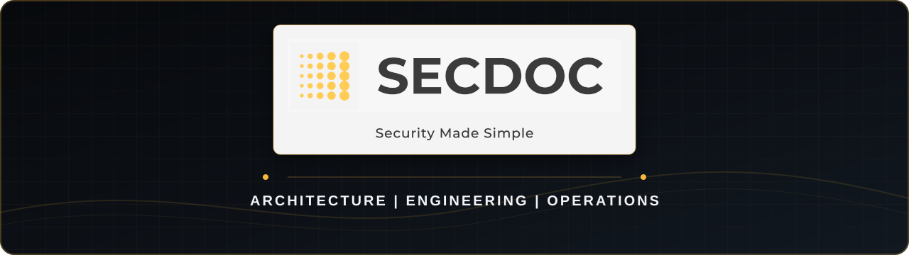

  

  <strong>Cybersecurity architect · Security engineering leader · Author · Educator</strong>

  
  

## I build security that has to work

I am Lester E. Nichols III, a cybersecurity architect with more than 25 years across security, infrastructure, networking, cloud, applications, and technology leadership. I hold an MS in Information Assurance as well as CISSP and GIAC certifications.

My work starts where diagrams and control language meet real systems. I publish deployable examples, sanitized reference architectures, detection content, and reusable automation for people who need to design, build, operate, and defend an enterprise.

<table>
<tr>
<td width="33%" valign="top"><strong>🏗️ Architecture</strong>  Security architecture, threat modeling, control design, cloud, network, application, and platform security.</td>
<td width="33%" valign="top"><strong>🛡️ Security operations</strong>  SIEM, detection engineering, threat intelligence, vulnerability management, SOAR, DFIR, and telemetry pipelines.</td>
<td width="33%" valign="top"><strong>⚙️ Engineering</strong>  DevSecOps, infrastructure as code, Linux, Windows, automation, and AI agent workflows for technical teams.</td>
</tr>
</table>

## The book

> **[Cybersecurity Architect's Handbook, Second Edition](https://www.amazon.com/Cybersecurity-Architects-Handbook-architects-enterprise/dp/180610539X)**
>
> An architect's guide to designing, building, and defending the modern enterprise. Published by Packt in 2026, it connects architecture principles to the technical, organizational, and leadership decisions that shape a working security program.

[Read about the book at secdoc.tech](https://secdoc.tech/two-books-for-the-price-of-one-the-cybersecurity-architects-handbook-second-edition-and-the-capstone-lab-that-builds-an-ai-powered-soc/) · [Get it on Amazon](https://www.amazon.com/Cybersecurity-Architects-Handbook-architects-enterprise/dp/180610539X)

## Start here

| Project | What it gives you |
|:--|:--|
| **[SOC Pipeline](https://github.com/secdoc/soc-pipeline-public)** | An end-to-end, IaC-deployed security operations pipeline that correlates network, DNS, endpoint, identity, and vulnerability telemetry, with AI enrichment, SOAR, and DFIR workflows. |
| **[DevSecOps Pipeline](https://github.com/secdoc/devsecops-pipeline-public)** | A sanitized, buildable reference for a self-hosted delivery plane that isolates untrusted builds, validates source and dependencies, produces SBOM and policy evidence, and promotes immutable artifacts. |
| **[AI Agent Skills](https://github.com/secdoc/AI-Agent-Skills)** | Practitioner-built skills for cybersecurity architecture, threat modeling, application and code security, networking, Linux, Windows, firewall engineering, and executive reporting. |
| **[WAF to SIEM](https://github.com/secdoc/socfortress-waf-siem)** | A first-class WAF detection lane from Caddy, Coraza, and OWASP CRS into Wazuh and Graylog, including collection, normalization, detections, and dashboards. |
| **[Greenbone to Wazuh and Graylog](https://github.com/secdoc/greenbone-wazuh-graylog)** | A read-only Greenbone/OpenVAS collector with normalized vulnerability findings, Wazuh rules, and dashboard content. |
| **[Technitium to Wazuh and Graylog](https://github.com/secdoc/technitium-wazuh-graylog)** | DNS query telemetry, enrichment, and detections for blocking, NXDOMAIN activity, DGA behavior, and tunneling signals. |

## Public security toolbox

<strong>Security operations architecture and integrations</strong>

 

- [soc-pipeline-public](https://github.com/secdoc/soc-pipeline-public): Sanitized, adaptable, end-to-end security operations architecture deployed with Terraform and Ansible.
- [socfortress-waf-siem](https://github.com/secdoc/socfortress-waf-siem): SOCFortress WAF telemetry collection, normalization, detections, and dashboards for Wazuh and Graylog.
- [greenbone-wazuh-graylog](https://github.com/secdoc/greenbone-wazuh-graylog): Read-only Greenbone/OpenVAS findings integrated with Wazuh and Graylog.
- [technitium-wazuh-graylog](https://github.com/secdoc/technitium-wazuh-graylog): Technitium DNS telemetry, enrichment, and behavioral detection content.
- [wazuh-unifi-detections](https://github.com/secdoc/wazuh-unifi-detections): Custom Wazuh decoders, rules, MITRE ATT&CK mappings, and dashboards for UniFi gateway logs.

<strong>Graylog and network telemetry</strong>

 

- [Graylog_Dashboards](https://github.com/secdoc/Graylog_Dashboards): Dashboards for DHCP, Maltrail, NAXSI, NetFlow, OPNsense, DNS, Suricata, and Zenarmor telemetry.
- [Graylog_Inputs](https://github.com/secdoc/Graylog_Inputs): Reusable Graylog inputs and parsers for network and security data sources.
- [Graylog_Pipeline](https://github.com/secdoc/Graylog_Pipeline): Pipeline rules for normalizing and processing network and security events.
- [OPNsense-24.7-Graylog-Grok-Patterns](https://github.com/secdoc/OPNsense-24.7-Graylog-Grok-Patterns): Grok patterns, pipelines, content packs, and dashboards for OPNsense filterlog and Suricata data.
- [Unifi-Graylog-Grok-Patterns](https://github.com/secdoc/Unifi-Graylog-Grok-Patterns): Grok patterns and pipeline rules for UniFi Network CEF events.

<strong>Detection content, automation, and professional resources</strong>

 

- [custom_suricata_rules](https://github.com/secdoc/custom_suricata_rules): Custom Suricata IDS and IPS rules for additional protocol and traffic visibility.
- [whois_search](https://github.com/secdoc/whois_search): A shell utility that performs WHOIS lookups from an IP address list and writes a report.
- [AI-Agent-Skills](https://github.com/secdoc/AI-Agent-Skills): Reusable AI agent skills built for technical security and architecture work.
- [Recommended_Reading](https://github.com/secdoc/Recommended_Reading): A maintained reading list for security, networking, operating systems, software development, AI, leadership, and technical careers.

## How I publish

- **Practitioner-built:** useful to engineers and architects doing the work.
- **Sanitized by design:** public examples do not disclose private environments or operational secrets.
- **Tradeoffs included:** architecture without constraints and failure modes is incomplete.
- **Built for reuse:** configurations, detections, runbooks, and reference patterns should be adaptable.

  <strong>More writing and architecture at <a href="https://secdoc.tech">secdoc.tech</a></strong>

---

Code and configuration are licensed under [Apache License 2.0](LICENSE). Documentation, guides, and diagrams are licensed under [CC BY 4.0](LICENSE-docs). Attribution is required. See [LICENSING.md](LICENSING.md) and [NOTICE](NOTICE).

## GitLab CI baseline

GitLab CI runs repository integrity validation and centralized ClamAV scanning on the isolated `phase4-untrusted` runner. The baseline validates tracked Python syntax, shell syntax, and JSON parsing without direct Internet access. Repository-specific build and test gates remain additive to this baseline.

